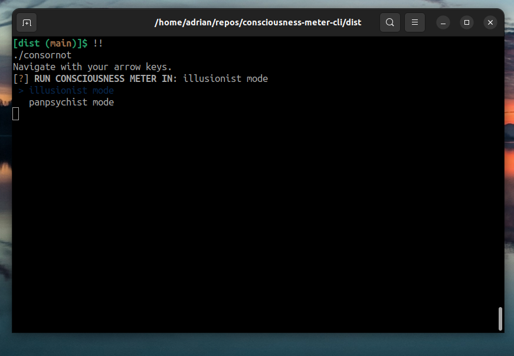

# Consciousness Meter CLI
This is a _Consciousness Meter_, which can be operated through a command line interface. It is fully functional, and -- provided certain conditions are met --- it is garanteed to be 100% accurate.

## What is a 'consciousness meter'?
In the 'The Character of Consciousness' by David Chalmers, a consciousness meter is defined as a hypothetical device that will measure whether or not a given object is conscious.[^1]

For example, if you point a consciousness meter at yourself, then it will scan you and report back that you are conscious -- if you point at another person who is awake, it will probably say they are conscious. If you point it at a person in a coma, or an inanimate object like a rock, it will probably say they are not (there might not be entirely true but we'll get to that in a second). The consciousness meter would be useful for descerning between, for example, a patient who is completely brain dead versus a pateint who is fully awake but completely paralyzed. It would also be useful for determining edge cases of lifeforms that are not obviously conscious but not obviously not conscious, either (examples include slugs, bugs, Venus Fly Traps, or a flying alien trapped on Venus).

A consciousness meter is usually described as some far-flung futuristic technology, like self-driving cars, quantum computers or printers that actually function properly. Case in point: Chalmers himself seems to be of the view that the mighty consciousness meter will not be here for some time to come,[^2] and the CIA even invited Chalmers to come give a talk for them --- they seemed visibly interested in the part of the talk about the consciousnes meter.[^3]

I think it is safe to say, then, that if we were to get a consciousness meter, it would be a huge technological advancement for humanity. That's where this program comes in.

## One small script for man, one giant leap for mankind
Ladies and gentlemen (or anyone else) I now present to you the world's first ever fully functioning consciousness meter. The future is now. This flar-flung futuristic technology, while still futuristic, is no longer exclusively confined to the future: it exists here and now, for free on GitHub.

How, you ask? Good question. I will explain how. Recall that, in the first paragraph of this document, I said that this consciousness meter is "100% accurate provided certain conditions are met." These conditions are that one of two philosophical frameworks be true: illusionism or panpsychism. The consciousness meter can work with either, since it runs in two modes: illusionist mode or panpsychist mode:

### What is panpsychism?
[Panpsychism](https://plato.stanford.edu/entries/panpsychism/) is the view that everything is conscious (yes, everything[^4]). It sounds crazy, but it is subscribed to by some prominent philosophers, and is an implication of certain reputable scientific theories, like [Integrated Information Theory](https://en.wikipedia.org/wiki/Integrated_information_theory).

### What is illusionism?
Illusionism (also known by the name of '[eliminative materialism](https://plato.stanford.edu/entries/materialism-eiminative/)') is the view that consciousness is an illusionism. Practically speaking,[^5] this amounts to the view that no one and nothing was, is or ever has been conscious. (This also sounds crazy, but luckily if its true it also means that pain -- being a state of consciosuness -- is also an illusion, so next time you stub your toe it may be of some comfort to you.)

### Why illusionism or panpsychism? 
Why does the consciousness meter only work if these two views are correct? The answer is quite straight-forward: if panpsychism is true then everything is conscious, and if illusionism is true then nothing is conscious. So constructing a consciousness meter for either of these two theories is actually quite easy. For panpsychism, you just need something that will mark any input as conscious, no matter what it is, and for illusionism you just need something that will mark any input as not conscious, no exception given. And with that, you have a fully functioning consciousness meter.

And that is what we have here: a fully functioning consciousness meter that works so long as either panpsychism or illusionism is true. If either of those theories work, then this consciousness meter will return accurate results 100% of the time (depending on what mode its in).

### Are you ripping us off?
Interesting question. Strictly speaking, _NO_ I am not ripping you off, since this GitHub and downloading this code not involve any sort of monetary transaction.

That said, I understand that some people may be of the feeling that this program is not what they were expecting. And fair enough: the consciousness meter was advertised as a revolutionary technology, but this code is really nothing more than a glorified  `if/else` statement. I am sympathetic to users who may find this dissapointing.

 So, to compensate for this, I have included within this package an assortement of gimmicks that are designed to make the whole thing _look_ futuristic, including high-tech-ufo sound effects, digital rain animations, and more. For those users who are still unimpressed, I have thrown in one additional gimmick which, though not necessarily futuristic, is still a lot of fun: an end credit scene set to a fun jingle.

# Downloading information

## Dependencies
The consciousness meter has a handful of dependancies dependancies: python3, pip3. pygame, and inquirer. If you wish to install this program manually, then installing these will be necessary.

To see if python3 is installed on your system, go to your terminal and input `python3 --version`. If python3 is installed on your system, it will give you a version number. If it's not, it will give you an error message, and you should go and install python3 before proceeding.

To see if pip3 is installed on your system, go to your terminal and input `pip3 --version`. If pip3 is installed on your system, it will give you a version number. If it is not installed, it will give you an error message, and you should go and install pip3 before proceeding.

Once you have python and pip, then install the modules by copy/pasting the following into your command line:

`pip3 install pygame && pip3 install inquirer`

## Installing
A prebuilt linux binary can be found on the sidebar. Other installation options to come.

If you wish to install manually, just run clone the repo and run `main.py` in your newfound directory. Things should work fine from there.

[^1]: Chalmers, David John (2010). [The character of consciousness](https://philpapers.org/rec/CHATCO-14). p. 49, 91, 99. New York: Oxford University Press.
[^2]: Chalmers, David John (2010). [The character of consciousness](https://philpapers.org/rec/CHATCO-14). p. xvi. New York: Oxford University Press.
[^3]: Chalmers, David John (2010). [The character of consciousness](https://philpapers.org/rec/CHATCO-14). p. xvii. New York: Oxford University Press.
Also see: Symes, J. (Host). (2020, July 19). [Episode 83](https://thepanpsycast.com/panpsycast2/episode83-1), The David Chalmers Interview (Part I - Consciousness). In The Panpsycast Philosophy Podcast
[^4]: Okay maybe they wouldn't say that _literally everything_ is consciousness --- many panpsychists might have reservations about abstract or higher-order objects like, for example, the nation of Canada. Strictly speaking then this program doesn't work for just any panpsychist, but only the super-duper-hardcore panpsychists. But these subtleties are no fun so I am just going to pretend that they don't exist for now.
[^5]: If we want to get pedantic, would could argue that it's _technically_ possible for both illusionism to be true and for some things to be conscious (something kinda, sorta not-really but maybe similar is arguably going on [here](https://philpapers.org/rec/ROEDPM)). But this would mean that consciousness just so happens to exist, even though we are mistaken about it existing in ourselves. But that doesn't make much sense, does it? So we can safely shelve this possibility and never think about it again.
